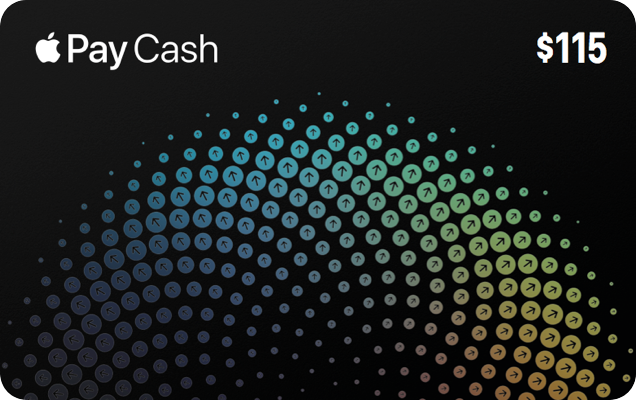

# Shiny

[](https://swift.org)
[](http://cocoapods.org/pods/Shiny)
[](http://cocoapods.org/pods/Shiny)
[](http://cocoapods.org/pods/Shiny)
[](https://github.com/Carthage/Carthage)

**Shiny** is an iOS library that generates an iridescent effect view matched to the gyroscope, similar to the Apple Pay Cash card in the Wallet app.




[Demo Video](https://gfycat.com/gifs/detail/NewGrotesqueKitten)

```
$ pod try Shiny
```

## Requirements

- iOS 9.0+
- Xcode 9.0+
- Swift 4

## Usage

Adding `ShinyView` programmatically (supports storyboard/xib too):

```swift
import Shiny

let shinyView = ShinyView(frame: CGRect(x: 0, y: 0, width: 320, height: 200))
shinyView.colors = [UIColor.red, UIColor.green, UIColor.blue, UIColor.gray]
shinyView.locations = [0, 0.1, 0.2, 0.3, 1]
shinyView.startUpdates() // necessary
view.addSubview(shinyView)
```

You must call `startUpdates()` for the instance to observe motion changes. Calling `stopUpdates()` on the instance will stop motion updates.

### Customization

The `ShinyView` exposes several properties to customize the radial gradient used to create the shiny effect:

```swift
var colors: [UIColor] // The color of each gradient stop.
var locations: [CGFloat]? // The location of each gradient stop. The default is `nil`.
var spread: CGFloat // The distance between colors on the gradient. The default is `0.8`.
var padding: CGFloat // The padding on the edges of the gradient. The default is `0.1`.
var sensitivity: CGFloat // The sensitivity of the gyroscopic motion. The default is `0.2`.
```

You can start/stop observing motion updates:

```swift
func startUpdates() // Starts listening to motion updates.
func stopUpdates() // Stops listening to motion updates.
```

## Installation

Shiny is available via CocoaPods and Carthage.

### CocoaPods
To install with [CocoaPods](http://cocoapods.org/), simply add this in your `Podfile`:
```ruby
use_frameworks!
pod "Shiny"
```

### Carthage
To install with [Carthage](https://github.com/Carthage/Carthage), simply add this in your `Cartfile`:
```ruby
github "efremidze/Shiny"
```

## Communication

- If you **found a bug**, open an issue.
- If you **have a feature request**, open an issue.
- If you **want to contribute**, submit a pull request.

## Apps Using _Shiny_

Feel free to submit a PR if you’re using this library in your apps.

## License

Shiny is available under the MIT license. See the LICENSE file for more info.
